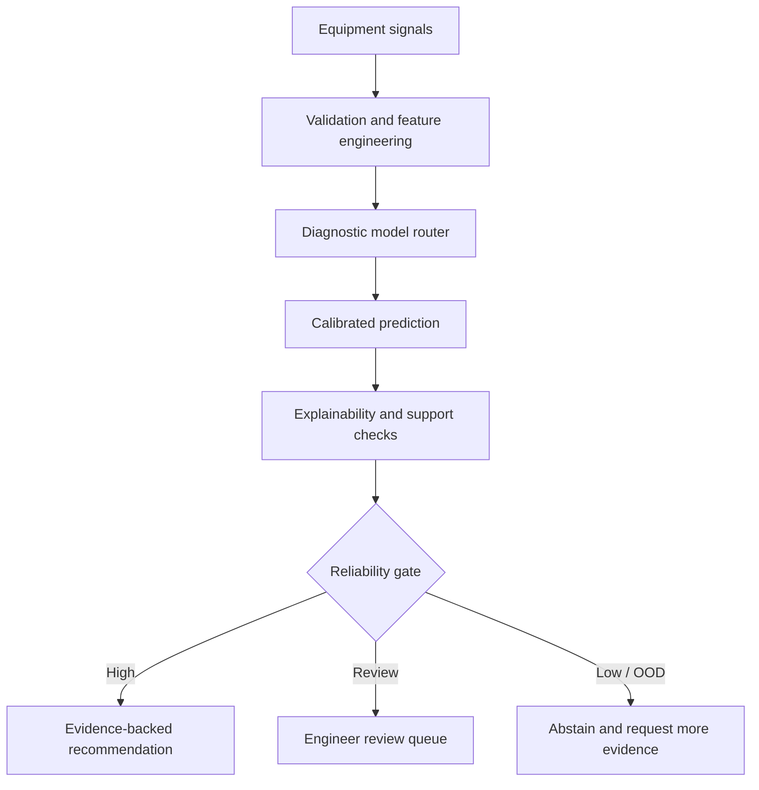

# Predictive Maintenance & Equipment Failure Intelligence Agent

A reliability-aware maintenance intelligence system developed during the **NeuralSeek AI Ignite Internship Program (Summer 2026)**. The project moves beyond a binary failure score: it combines calibrated machine learning, explainability, evidence retrieval, operating-context checks, and human-review escalation to turn equipment signals into defensible maintenance actions.

## Why this project

Industrial equipment usually produces warning signals before a breakdown, but the evidence is fragmented across sensor streams, maintenance history, manuals, and individual expertise. This project unifies those sources into an agent that can:

- detect abnormal operating behavior;
- estimate failure risk with calibrated probabilities;
- explain which signals influenced the result;
- retrieve relevant maintenance and troubleshooting evidence;
- recommend what a technician should inspect first; and
- escalate uncertain, unsupported, or out-of-distribution cases for human review.

## System architecture



The final design supports multiple diagnostic paths, including benchmark failure classification, MetroPT compressor anomaly analysis, and hydraulic component-condition inference. A shared reliability layer keeps prediction confidence, input support, operating context, and human-review policy consistent across modules.

## Core modeling results

The primary benchmark used a held-out set of 1,500 observations. The calibrated Random Forest was selected as the core failure-risk model because it provided the strongest balance of precision, recall, ranking quality, and probability calibration.

| Model | Precision | Recall | F1 | ROC-AUC | PR-AUC | Brier score |
|---|---:|---:|---:|---:|---:|---:|
| Calibrated Random Forest | 0.8936 | 0.8235 | 0.8571 | 0.9835 | 0.9039 | 0.0085 |
| Calibrated XGBoost | 0.8400 | 0.8235 | 0.8317 | 0.9858 | 0.8760 | 0.0099 |

At the selected high-risk threshold (approximately `0.641`), the holdout population was separated into:

- **HIGH:** 44 cases requiring prompt inspection;
- **REVIEW:** 33 cases requiring additional evidence or engineering judgment; and
- **LOW:** 1,423 cases suitable for routine monitoring.

## Reliability-aware decision policy

A prediction is not treated as actionable merely because its probability is high. The agent also evaluates:

1. **Probability calibration** - whether predicted risk aligns with observed outcomes.
2. **Input support** - whether the current signal pattern is represented in development data.
3. **Operating context** - whether the asset is stable, loaded, transitioning, or otherwise outside a validated regime.
4. **Explanation quality** - whether influential features and evidence support the recommended action.
5. **Human-review policy** - whether uncertainty, disagreement, or missing evidence requires escalation.

See [the model card](docs/model-card.md) and [system architecture](docs/architecture.md) for details.

## Key engineering features

- failure classification with Logistic Regression, Random Forest, Gradient Boosting, Extra Trees, and XGBoost;
- randomized hyperparameter search and cross-validation using PR-AUC as the primary selection metric;
- sigmoid probability calibration with Brier score and log-loss evaluation;
- feature engineering for temperature differential, mechanical-power proxy, and wear/torque interactions;
- SHAP-based global and local explanations;
- LOW / REVIEW / HIGH risk banding;
- out-of-distribution and operating-regime support checks;
- retrieval of maintenance guidance and comparable evidence;
- structured REST responses with findings, limitations, reliability state, and human-review requirements.

## Repository contents

```text
.
├── docs/
│   ├── architecture.md
│   └── model-card.md
├── examples/
│   └── sample-response.json
├── src/
│   └── risk_policy.py
└── README.md
```

This public portfolio repository contains the system design, evaluation summary, and reusable decision-policy examples. Large datasets, trained model artifacts, and internship-internal materials are intentionally not redistributed.

## Skills demonstrated

`Python` · `scikit-learn` · `XGBoost` · `SHAP` · `Model calibration` · `Anomaly detection` · `RAG` · `REST APIs` · `Reliability engineering` · `Human-in-the-loop AI`

## Author

**Pratheswaran Hariharan**  
[LinkedIn](https://www.linkedin.com/in/pratheswaran-hariharan-a78382214/) · [GitHub](https://github.com/Pratheswaran)
