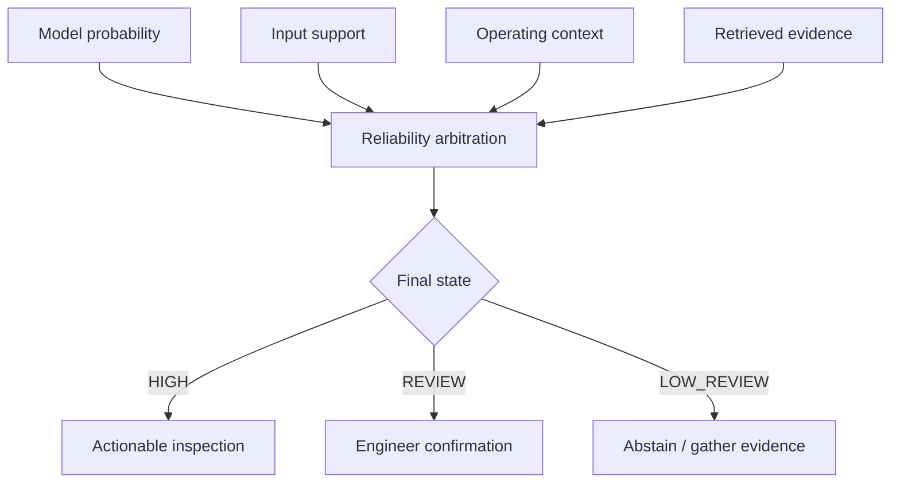

# System Architecture

## Design principle

The machine-learning model is one evidence source, not the whole product. The agent separates diagnosis, reliability assessment, evidence retrieval, and action recommendation so that each decision can be audited.

## Processing stages

1. **Route the asset** to the appropriate diagnostic module using equipment type and input schema.
2. **Validate the input** for missing values, physical range violations, and schema mismatches.
3. **Engineer features** that capture thermal, mechanical, wear, pressure, vibration, and operating-regime behavior.
4. **Run the diagnostic model** and produce class probabilities or anomaly evidence.
5. **Calibrate the probability** using the frozen policy associated with that component and model.
6. **Assess input support** through range checks and latent-neighborhood distance.
7. **Assess operating context** so unsupported transitions cannot retain high reliability.
8. **Retrieve maintenance knowledge** relevant to the detected component and symptom pattern.
9. **Arbitrate the evidence** into a HIGH, REVIEW, or LOW_REVIEW reliability state.
10. **Return a structured response** with findings, supporting metrics, limitations, inspection order, and the human-review requirement.

## Diagnostic modules

### Benchmark failure-risk model

Uses process temperature, air temperature, rotational speed, torque, tool wear, product type, and engineered interactions. A calibrated Random Forest provides the primary probability estimate; alternative models are retained for comparison and disagreement analysis.

### MetroPT compressor module

Uses windowed operational signals, operating-regime labels, anomaly models, and context checks to separate supported abnormal behavior from transition effects and unsupported conditions.

### Hydraulic condition module

Routes evidence across accumulator, cooler, pump, and valve models. Component-specific probability policies and stability rules prevent a single global threshold from overstating confidence.

## Reliability arbitration

High model confidence cannot override unsupported input or unvalidated operating context. This monotonic downgrade rule is the core safety behavior of the system.
